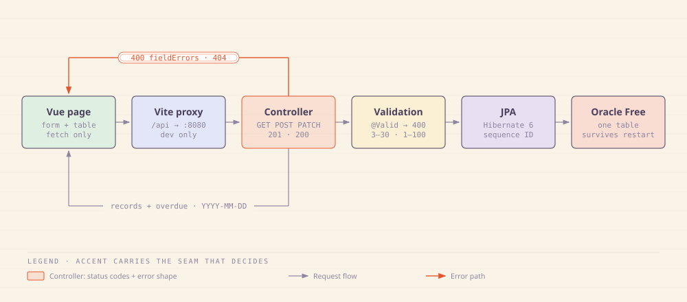
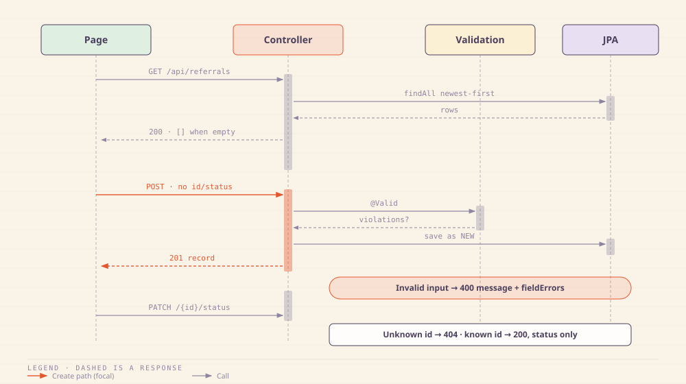
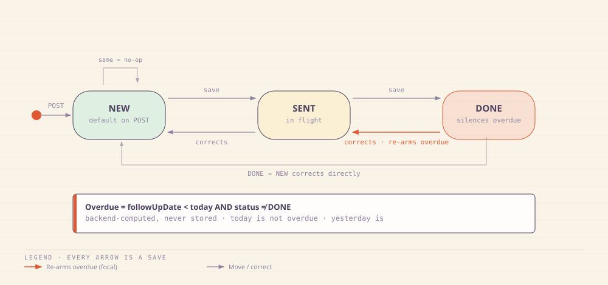
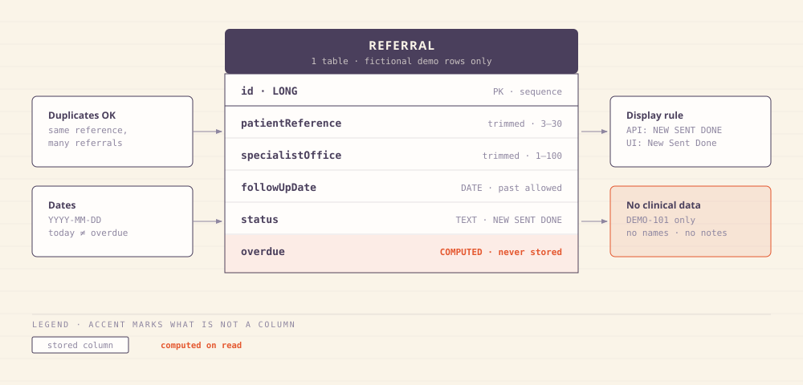

# r3f3r

Track specialist referrals and see which ones need a follow-up.

## How it works



One page, one table, one path: native fetch through a Vite proxy to Spring, overdue computed on the way back.



Three calls: list newest-first, create as NEW (201), patch status only (200). Bad input gets 400 with field errors; unknown IDs get 404.



NEW → SENT → DONE, freely reversible for corrections. Saving the unchanged status is a no-op. Done → Sent re-arms overdue.



One table, six fields, zero joins. Overdue is computed on read and never stored. Fictional demo rows only (`DEMO-101`).

## First version

The page has an add form (patient reference, specialist office, follow-up date) above a referral table with a status dropdown and Save per row. A referral shows Overdue when its follow-up date is before today and its status is not Done; today is not overdue.

Vue 3 + Vite with plain JavaScript and CSS (no Router, Pinia, component lib). Java 21 Spring Boot API (`backend/pom.xml` pins Boot 3.5.16), Spring Data JPA against Oracle Database Free.

## Demo data only

Use fictional references such as DEMO-101 and invented office names. Do not enter patient names, dates of birth, diagnoses, or clinical notes.

This is a local learning application, not software for clinical use. No login, messaging, attachments, or connections to healthcare systems.

## Prerequisites

- Java 21 (or newer) with `JAVA_HOME` set
- npm 11+ and Node.js 22.18+ (this was checked with Node 26.0.0 and npm 11.12.1)
- Maven is not required directly; the backend ships the Maven wrapper (`./mvnw`), which downloads Maven on first run
- A database: Oracle Database Free for the real path, or the built-in H2 fallback for local development without a database

## Running the app

Two local servers: the backend on `http://localhost:8080` and the frontend on `http://localhost:5173`. The Vite dev server proxies `/api` to the backend, so the browser always talks to `http://localhost:5173`.

### 1. Start the backend

```bash
cd backend
./mvnw spring-boot:run
```

The backend reads its database connection from environment variables. The defaults use an in-memory H2 database, so it starts immediately with no Oracle setup:

| Variable | Default | Meaning |
| --- | --- | --- |
| `REFERREE_DB_URL` | `jdbc:h2:mem:r3f3r;DB_CLOSE_DELAY=-1;MODE=Oracle` | JDBC URL |
| `REFERREE_DB_USER` | `sa` | Database user |
| `REFERREE_DB_PASSWORD` | *(empty)* | Database password |
| `REFERREE_DB_DRIVER` | `org.h2.Driver` | Driver class |
| `REFERREE_DB_DIALECT` | `org.hibernate.dialect.H2Dialect` | Hibernate dialect |

To point the app at Oracle, set those variables (see [Database setup](#database-setup)).

### 2. Start the frontend

```bash
cd frontend
npm install
npm run dev
```

Open `http://localhost:5173`.

### 3. Check the connection

The home page calls `GET /api/health` and shows "Backend connected" when the backend is up, or "Backend unavailable" when it is not.

## Database setup

### Oracle Database Free (recommended)

Run Oracle locally or via Docker. If you use Docker Hub directly, log in first:

```bash
# Oracle's official image needs an Oracle account login.
# The community gvenzl/oracle-xe image works without login:
docker run -d --name oracle-free \
  -p 1521:1521 \
  -e ORACLE_PASSWORD=Oracle_password1 \
  gvenzl/oracle-xe:21-full
```

Give it a few minutes to initialize, then confirm the listener is up:

```bash
docker logs oracle-free --follow
# Wait for: "Database instance created." then: "HOST_XE is ready."
```

Then start the backend against Oracle:

```bash
cd backend
REFERREE_DB_URL=jdbc:oracle:thin:@//localhost:1521/XE \
REFERREE_DB_USER=SYSTEM \
REFERREE_DB_PASSWORD=Oracle_password1 \
REFERREE_DB_DRIVER=oracle.jdbc.OracleDriver \
REFERREE_DB_DIALECT=org.hibernate.dialect.OracleDialect \
./mvnw spring-boot:run
```

If your container reports a different service name than `XE`, use that name in the JDBC URL instead.

### H2 fallback

With no environment variables set, the backend uses H2 in Oracle mode. This is for local development only — restart it and the data is gone.

## Demo walkthrough

1. Start the backend and frontend as above.
2. Open `http://localhost:5173`.
3. In the **Add a referral** form, enter:
   - Patient reference: `DEMO-101`
   - Specialist office: `Cardiology West`
   - Follow-up date: *any past date this week*
4. Click **Add**. The referral appears in the table with an **Overdue** label, because its follow-up date is in the past and its status is New.
5. Open the status dropdown and choose **Done**. Click **Save**. The label changes to **Current** — a Done referral is never overdue.
6. Open the dropdown again, choose **Sent**, and click **Save**. The **Overdue** label returns, because a past-due Sent referral is overdue again.

Try submitting an empty form: messages appear beside each field and the values you typed are preserved.

## Testing

```bash
cd backend
./mvnw test
```

Tests run against H2 in Oracle mode: the referral REST API (create, list, status update, 400/404) and the overdue/status business rules (today is not overdue, a past outstanding referral is overdue, Done is never overdue, Done returned to Sent is overdue again).
