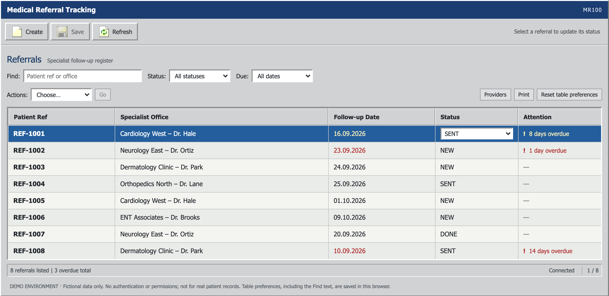
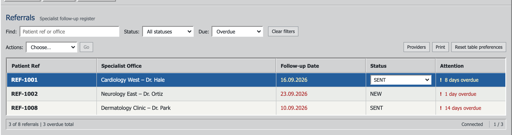
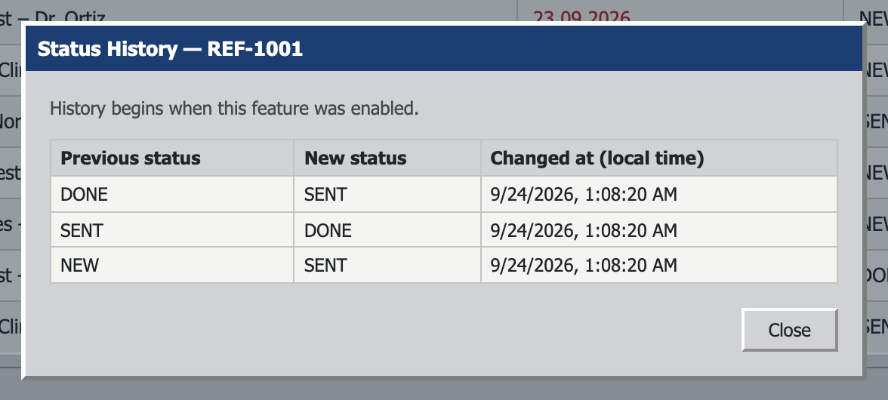
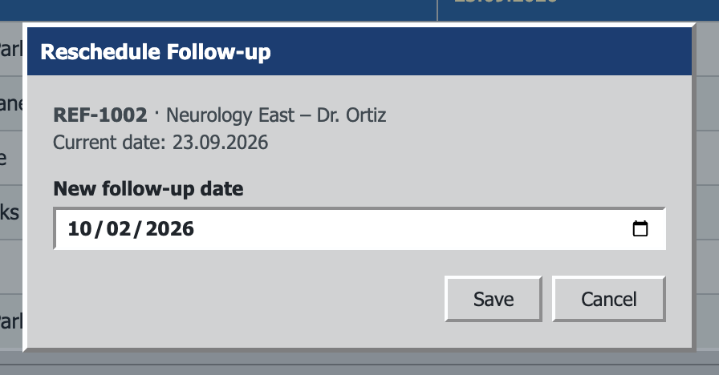
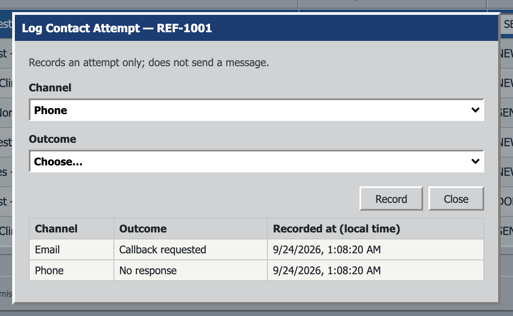
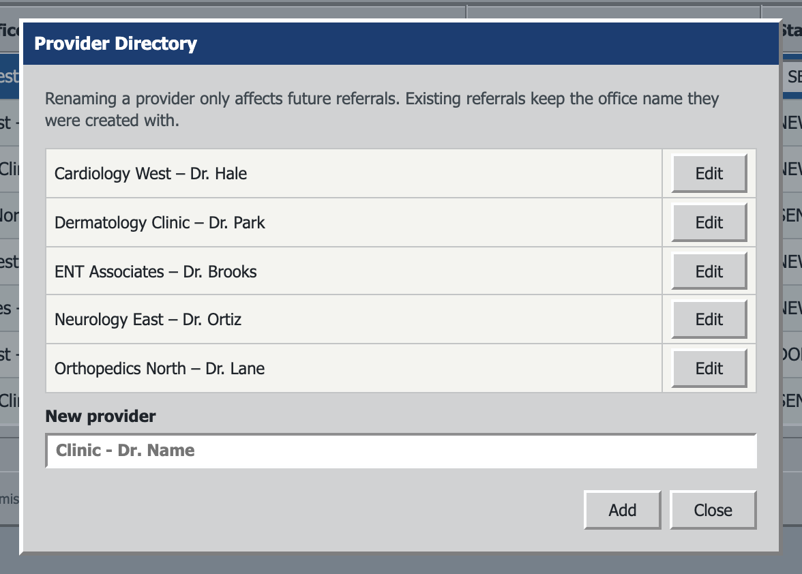
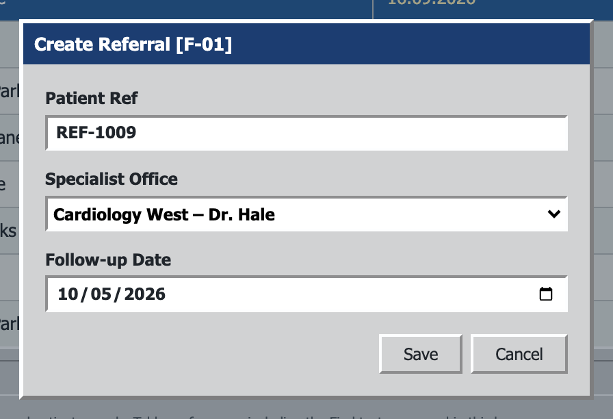
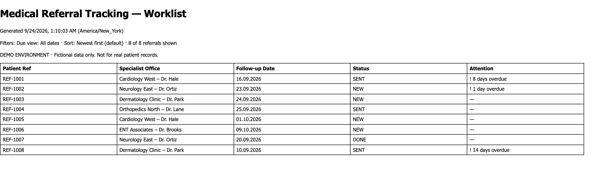

<h1 align="center">
   r3f3r
</h1>

<p align="center">
  
  
  
  
  
  
</p>

<p align="center">
  <strong>The referral follow-up tracker for one busy coordinator.</strong><br/>
  Log specialist referrals, see what's overdue at a glance, and chase every follow-up from one compact SE98-style workbench.
</p>

<h3 align="center"><a href="#quick-start"><ins>Run it locally</ins></a></h3>

<p align="center">
  
</p>

## Features

<table>
<tr>
<td width="50%" valign="middle">

### Due-Date Views

One **Due** filter — All dates, Overdue, Due today, Next 7 days — stacks with Find and Status. Day counts come from the backend, so the browser's timezone can't move a referral between views.

[Spec →](docs/extension-spec.md#s2--due-date-views)

</td>
<td width="50%">
  
</td>
</tr>
<tr>
<td width="50%" valign="middle">

### Status History

Every real status change is recorded atomically with the update — the old status, the new one, and when. Saving the same status twice records nothing.

[Spec →](docs/extension-spec.md#m1--status-history)

</td>
<td width="50%">
  
</td>
</tr>
<tr>
<td width="50%" valign="middle">

### Reschedule in One Step

Move a follow-up date without recreating the referral. The row's overdue flag, due view, and counters update the moment the server confirms.

[Spec →](docs/extension-spec.md#s1--reschedule-follow-up)

</td>
<td width="50%">
  
</td>
</tr>
<tr>
<td width="50%" valign="middle">

### Contact-Attempt Log

Record each phone or email attempt and its outcome, so nobody calls the same office twice. It logs only — it never sends a message or changes the referral.

[Spec →](docs/extension-spec.md#m3--contact-attempt-log)

</td>
<td width="50%">
  
</td>
</tr>
<tr>
<td width="50%" valign="middle">

### Provider Directory

Keep specialist-office names consistent. Duplicates are caught regardless of case or outer spaces, and renaming a provider never rewrites past referrals.

[Spec →](docs/extension-spec.md#m2--provider-directory)

</td>
<td width="50%">
  
</td>
</tr>
<tr>
<td width="50%" valign="middle">

### Pick a Provider on Create

New referrals default to the directory, with an explicit **Enter office manually** escape hatch. Old free-text referrals keep working untouched.

[Spec →](docs/extension-spec.md#m2--provider-directory)

</td>
<td width="50%">
  
</td>
</tr>
<tr>
<td width="50%" valign="middle">

### Printable Worklist

Print exactly what's on screen — same filters, same order — as a plain black-and-white table with the filter context and a timestamp. No PDF service, just the browser.

[Spec →](docs/extension-spec.md#s4--printable-worklist)

</td>
<td width="50%">
  
</td>
</tr>
</table>

**Also in the box:**

- **[Days overdue](docs/extension-spec.md#s3--days-overdue)** — "1 day overdue" or "N days overdue" in the Attention column, using calendar-day math. `DONE` is never overdue.
- **[Remembered table preferences](docs/extension-spec.md#s5--remember-table-preferences)** — Find, Status, Due view, and sort come back after a reload. Corrupt or blocked storage falls back to defaults.
- **Reversible statuses** — `NEW → SENT → DONE` in any direction, whenever you need it.
- **Unsaved-change guard** — asks before a filter, row switch, or dialog would throw away an edited status.
- **Keyboard-friendly** — arrow keys move the selection, Enter saves, Escape closes any dialog that isn't mid-save.
- **Honest errors** — every failure is `{ message, fieldErrors }` with a 400, 404, 409, or 500. No stack traces or SQL reach the browser.

---

## Built With

A single-page Vue app talking to one Spring Boot API — no router, store, UI kit, or date library.

<p>
  <a href="https://vuejs.org"><kbd> Vue 3</kbd></a> &nbsp;
  <a href="https://vite.dev"><kbd> Vite</kbd></a> &nbsp;
  <a href="https://spring.io/projects/spring-boot"><kbd> Spring Boot</kbd></a> &nbsp;
  <a href="https://spring.io/projects/spring-data-jpa"><kbd> Spring Data JPA</kbd></a> &nbsp;
  <a href="https://openjdk.org"><kbd> Java 21</kbd></a> &nbsp;
  <a href="https://www.oracle.com/database/free/"><kbd> Oracle Database Free</kbd></a> &nbsp;
  <a href="https://h2database.com"><kbd> H2</kbd></a> &nbsp;
  <a href="https://github.com/nestoris/Win98SE"><kbd> SE98 icons</kbd></a>
</p>

---

## Quick Start

**Prerequisites:** Java 21+ with `JAVA_HOME`, Node.js 22.18+ (or 24.12+) with npm 11+, and Docker only if you want Oracle.

```bash
# 1. Backend — Spring Boot on :8080, local H2 file database in backend/data/
cd backend && ./mvnw spring-boot:run

# 2. Frontend — Vite on :5173, proxies /api to the backend
cd frontend && npm install && npm run dev
```

Then open **http://localhost:5173**. With no database variables set, the backend starts immediately on H2 and keeps your data across restarts. Delete `backend/data/` to start fresh.

<details>
<summary><strong>Run on Oracle Database Free</strong></summary>

<br/>

Use the community `gvenzl/oracle-free` image. It ships a native `arm64` build and needs no Oracle account. On Apple Silicon, avoid `oracle-xe:21-full`: it's `amd64`, and under Rosetta its background processes won't start. Give Docker (or Colima) at least 2–4 GB of RAM.

```bash
colima start --memory 4                    # if using Colima
docker run -d --name oracle-free -p 1521:1521 --shm-size=2g \
  -e ORACLE_PASSWORD=Oracle_password1 \
  -e APP_USER=referree -e APP_USER_PASSWORD=referree_pw \
  gvenzl/oracle-free:latest
```

Wait for `Pluggable database FREEPDB1 opened read write`, then:

```bash
cd backend
REFERREE_DB_URL=jdbc:oracle:thin:@//localhost:1521/FREEPDB1 \
REFERREE_DB_USER=referree \
REFERREE_DB_PASSWORD=referree_pw \
REFERREE_DB_DRIVER=oracle.jdbc.OracleDriver \
REFERREE_DB_DIALECT=org.hibernate.dialect.OracleDialect \
./mvnw spring-boot:run
```

| Variable | Default |
| --- | --- |
| `REFERREE_DB_URL` | `jdbc:h2:file:./data/r3f3r;DB_CLOSE_DELAY=-1;MODE=Oracle` |
| `REFERREE_DB_USER` | `sa` |
| `REFERREE_DB_PASSWORD` | *(empty)* |
| `REFERREE_DB_DRIVER` | `org.h2.Driver` |
| `REFERREE_DB_DIALECT` | `org.hibernate.dialect.H2Dialect` |

> [!WARNING]
> The extension schema (history, contacts, providers) has only been verified on H2. `schema.sql` adds `referral.provider_id` with H2's `ADD COLUMN IF NOT EXISTS`, so an existing Oracle schema may need that column added by hand.

Stop Oracle with `docker stop oracle-free`, or `colima stop` to shut down the whole Docker VM.

</details>

<details>
<summary><strong>Production build</strong></summary>

<br/>

`cd frontend && npm run build` writes static files to `frontend/dist/`. The `/api` proxy only exists in `npm run dev`, so the built app needs another route to the backend:

- **Same origin (recommended):** serve `dist/` and reverse-proxy `/api/*` to Spring Boot, e.g. nginx `location /api/ { proxy_pass http://localhost:8080; }`.
- **Different origin:** bake in the URL with `VITE_API_BASE_URL=https://api.example.com/api npm run build`. The backend has no CORS config, so browsers will block this unless you add CORS headers.

</details>

---

## Developing

- **Tests:** `cd backend && ./mvnw test` runs JUnit and MockMvc against in-memory H2 in Oracle mode. The frontend has a build check (`npm run build`) but no test suite yet.
- **Dev container:** `.devcontainer/` includes a Node 20 image with an outbound firewall. Open the folder in VS Code and choose **Reopen in Container**.
- **Proxy target:** the Vite proxy defaults to `:8080`. Set `API_TARGET=http://localhost:8081` to point a second dev server at a separate backend.
- **Docs:** the [roadmap](docs/roadmap.md), the [extension spec](docs/extension-spec.md) behind every feature above, and the [design brief](docs/design-brief.md).

<details>
<summary><strong>API at a glance</strong></summary>

<br/>

| Method | Path | Does |
| --- | --- | --- |
| `GET` | `/api/referrals` | List referrals, newest first, with `overdue`, `daysUntilFollowUp`, `daysOverdue` |
| `POST` | `/api/referrals` | Create with `specialistOffice` **or** `providerId` (always starts `NEW`) |
| `PATCH` | `/api/referrals/{id}/status` | Set `NEW` / `SENT` / `DONE`; real changes are recorded in history |
| `PATCH` | `/api/referrals/{id}/follow-up-date` | Reschedule (`YYYY-MM-DD`) |
| `GET` | `/api/referrals/{id}/history` | Status changes, newest first |
| `GET` `POST` | `/api/referrals/{id}/contact-attempts` | List or record `PHONE`/`EMAIL` attempts |
| `GET` `POST` | `/api/providers` | List or add providers |
| `PATCH` | `/api/providers/{id}` | Rename a provider |
| `GET` | `/api/health` | Liveness check |

</details>

<details>
<summary><strong>Architecture diagrams</strong></summary>

<br/>


</details>

---

## Boundaries

r3f3r is a local learning app, not clinical software.

- **Fictional data only.** Never enter patient names, dates of birth, diagnoses, or clinical notes.
- One simulated coordinator: no login, accounts, or permissions.
- No messaging, attachments, calendar sync, deletion, pagination, or healthcare-system integrations.

## Credits

Toolbar icons come from the [SE98 icon theme](https://github.com/nestoris/Win98SE) (GPL-2.0). See [`ATTRIBUTION.md`](frontend/public/icons/se98/ATTRIBUTION.md) for the source of each file.

## License

The project has no license file yet, so default copyright applies and all rights are reserved. The bundled SE98 icons keep their own [GPL-2.0 license](frontend/public/icons/se98/LICENSE).
